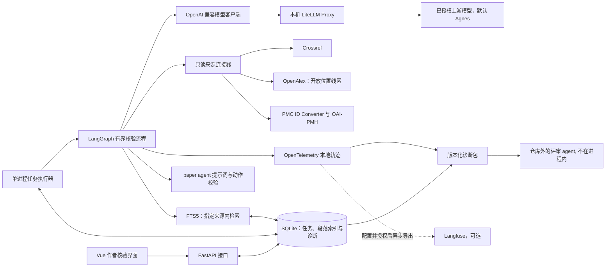
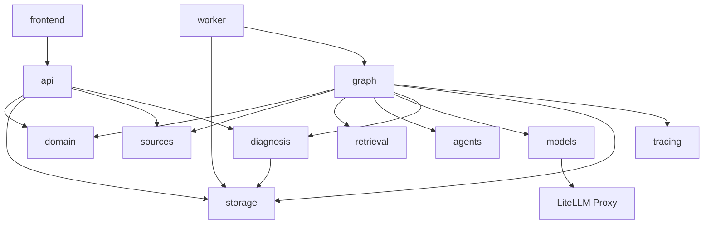
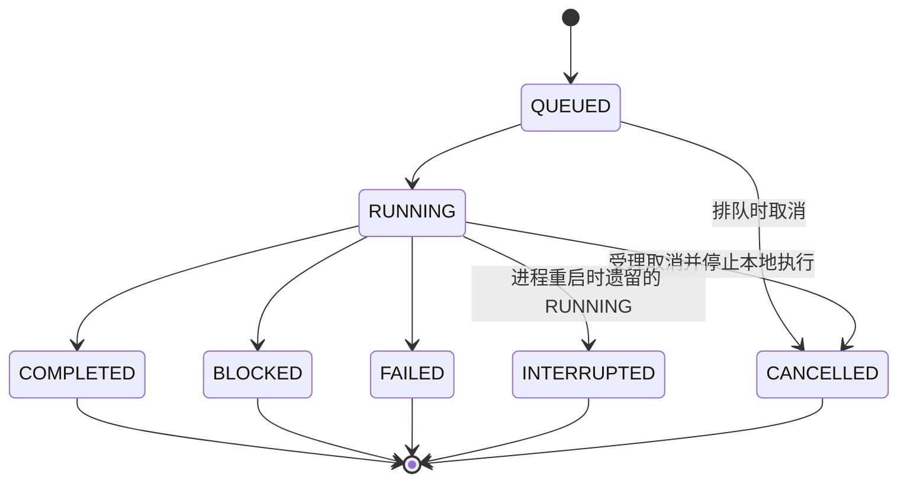
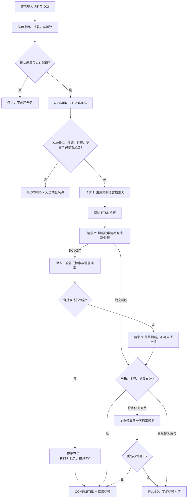

# 架构设计：论文引文证据核验 Agent

状态：设计稿\
版本：0.5\
日期：2026-09-28\
作者：Wynn\
读者：实现\
相关文档：[术语表](glossary.md)、[产品需求](prd.md)、[测试方案](test-plan.md)、[技术选型](tech-stack.md)

句子标记见 [术语表](glossary.md)。本文写组件、代码布局、状态迁移、接口和失败处理。结果标签、错误码和诊断包字段以术语表为准。参赛测试见 [测试方案](test-plan.md)。研究方案不在本文，也不进入运行时依赖。

## 1. 系统边界与组件

**规则**：首版在本机运行，一次处理一条论断和一篇被引文献。论断、任务记录和获准处理的段落在本机保存。作者同意后，才把论断与候选开放片段发送给配置的模型，供 paper agent 使用。一个 paper agent 在预算内完成多步核验。模型请求统一经过本机 LiteLLM Proxy，整次任务的接收方和预算先获授权。诊断包和轨迹交给仓库外的评审 agent；它们不在本进程内。文献连接器只读。模型不能指定任意网址、访问本地文件或修改来源记录。



前端与 API、执行器分开，是为了让外部请求和模型延迟不占用页面。任务写入 SQLite。执行器一次处理一个任务。paper agent 是唯一的 Agent 角色，模型调用可以多次。仓库外的评审 agent 不自由搜索，也不改任务目标。首版没有账户服务，也没有分布式队列。组件取舍见 [技术选型](tech-stack.md)。

## 代码布局

**规则**：实现时按下面的目录划分模块。不要把接口、图谱节点、来源连接器和测试放进同一个包。

- `frontend/`：作者界面。不保存密钥，不写判断规则。
- `backend/paper_evidence/domain/`：结果标签、任务状态、错误码、诊断包模型。无网络，无数据库。
- `backend/paper_evidence/storage/`：SQLite 与 FTS5。
- `backend/paper_evidence/sources/`：Crossref、PMC、OpenAlex。只读官方端点，包括受限的 DOI 解析检查，不调用模型。
- `backend/paper_evidence/retrieval/`：当前文献的切分与检索。
- `backend/paper_evidence/agents/`：只放 paper agent 的提示词和输出结构校验。不能自己发 HTTP，也不能读本地文件。图谱不编排第二个 agent。
- `backend/paper_evidence/models/`：OpenAI 兼容客户端及网关元数据适配。只连接已配置 Proxy，关闭客户端重试，不直连供应商。
- `backend/paper_evidence/graph/`：LangGraph 节点。编排来源、检索、模型客户端，验证动作和预算；网络由连接器及客户端执行。
- `backend/paper_evidence/diagnosis/`：从任务记录投影诊断包，并做脱敏。不自动改任务，也不充当路径二的测试产品。
- `backend/paper_evidence/tracing/`：本地 OpenTelemetry 与可选 Langfuse 脱敏异步导出，不参与业务状态判定。
- `backend/paper_evidence/api/`：运行配置预览、只读来源解析、任务入队/查询/取消、反馈/删除和诊断包导出；不运行核验图谱。
- `backend/paper_evidence/worker/`：一次运行一个任务。
- `tests/`：按 [测试方案](test-plan.md) 的维度分目录，包括 `functional/`、`tools/`、`retrieval/`、`session/`、`adversarial/`、`boundary/`、`performance/` 和 `e2e/`。
- `eval/`：若放置研究数据，只给研究评测使用。运行时包不得导入它。



**规则**：界面只调用 API。API 不进入图谱节点。API 可调用只读来源解析与诊断投影。图谱可以调用领域、来源、检索、Agent、模型客户端、诊断、存储和轨迹。Agent 与来源互不调用。诊断可以读存储以投影诊断包，但不能改任务状态。

来源和许可由 sources 提供，切分/FTS5/邻居读取由 retrieval 与 storage 完成；agents 只构造提示词及校验结构；graph 验证动作范围、编排 models 调用并保存阶段结果。diagnosis 从本地记录投影版本化诊断包，不运行第二名 Agent。

## 2. 执行流程与状态

状态定义见 [任务状态](glossary.md#2-任务状态)。下图里的终态名称与该表一致。



**规则**：进程启动时，遗留 RUNNING 若已持久化 cancel_requested，则标为 CANCELLED；其余标为 INTERRUPTED，由作者明确重试。重试不沿上图把终态改回 `QUEUED`。它新建一条 `QUEUED` 任务，并保留原记录，避免静默重复外部调用。



图示为正常与最终输出校验路径。每次请求（包括查询生成和中间动作）也检查结构；网络失败、非法动作、预算越界按下表处理，不能跳过这些出口。第一次检索为空时，请求 2 必须申请补充查询，不能直接以检索为空结束；不符合该动作约束时按输出校验处理。对无法独立判断的多主张输入，最终只能说明歧义并提示拆分，不输出确定判断。完成补充检索后无候选可直接生成「证据不足」及 `RETRIEVAL_EMPTY`，不必消耗请求 3；有候选时由请求 3 提交最终判断。仍有片段但不充分时，模型提交证据不足并说明限制，错误码为 null。

### 动作与预算

**规则**：请求 1 输出文献语言的非空 queries 字符串数组；请求 2 输出 `action=final` 加最终判断，或 `action=retrieve` 加 queries 和 neighbor_paragraph_ids；请求 3 仅能 final。它们都是同一个 paper agent 的不同步骤，不新增内部评审。retrieve 至少提供一个查询或已知邻居段落 ID；初次无候选时必须提供非空 queries。查询生成只发送论断与已确认的书目/文献语言，不发送整篇正文；判断只发送获准候选片段。

- `search(source_id, queries)` 与 `read_neighbors(source_id, paragraph_ids)` 只访问当前任务冻结的来源。source_id 由工作流绑定；模型只提交查询及当前来源已知段落 ID。非法段落 ID、任意 URL/路径等动作输入不执行。
- 初始检索为 round=0；补充查询和邻居读取合并为唯一的 round=1，去重后进入上下文。按 [D4](tech-stack.md#d4-状态与检索) 逐词转义并组合 FTS5 MATCH，再绑定 SQL 参数；模型文本既不能成为 SQL，也不能成为 MATCH 操作符。程序执行检索失败为 RETRIEVAL_FAILED，不触发模型修复。
- 每任务最多三个主逻辑请求，加一个全局输出修复请求。修复任一阶段后继续原流程，不增加主请求配额，也不重置补读次数。
- 结构、动作字段或摘录错误可以修复一次；修复只得到原请求的已核对材料及该响应全部可检测的校验错误（结构可解析后同时检查来源和摘录），不增加来源或工具权限。修复仍错则失败，保留两次输出的本地记录与验证结果。全任务共享一次修复是避免延长调用链的工程取舍；后续另一响应出错不重置次数，结构无法解析时也不能声称已检查其摘录。
- 请求 3 再要求补读或任何即将超出授权预算的动作，调用前终止为 `BUDGET_EXCEEDED`；不得伪装成证据不足。请求 2 的非法字段则按输出校验处理。
- 每个逻辑请求最多两个实际上游尝试，恢复与回退共用一次机会，故整任务最多八个上游尝试。模型客户端不重试；Proxy 执行 [D6](tech-stack.md#d6-模型适配) 的恢复策略，工作流不能再叠加网络重试。
- 上述次数是初始工程上限，不是最优参数或性能结果。超时采用下节默认值；检索上下文上限在实现配置中显式设置并纳入 config_digest。改变配置不能扩大正在执行任务的授权，评测运行冻结该配置。

前置完整性检查发现内容不足时不调用模型；若补读时才发现判断依赖缺失图表，也进入 `CONTENT_INCOMPLETE`，不把缺失内容补成结论。完成检索仍不足属于学术结果；上游故障、无效输出和预算阻断属于执行失败。所有终态都可导出诊断包；外部评审不同意见不回写任务。

来源身份按这个顺序核对：DOI 标准化及 Crossref 元数据、作者确认题名、[PMC DOI/PMCID 转换](https://pmc.ncbi.nlm.nih.gov/tools/id-converter-api/)、PMC 记录中的 DOI 与版本一致性、逐篇许可。OpenAlex 提供开放位置和版本线索。它的“开放获取”字段单独使用时，不能当作复用许可。许可允许的自动处理范围见 [D9](tech-stack.md#d9-文献来源)。[OpenAlex 对许可字段的说明](https://help.openalex.org/data/works/open-access/)、[PMC 获取规则](https://pmc.ncbi.nlm.nih.gov/tools/oai/)

### 取消与截止时间

**规则**：默认每次模型上游尝试 45 秒、每次来源 HTTP 请求 15 秒、每任务执行 180 秒。总时限从 worker 原子领取任务并转为 RUNNING 起算，包含来源处理、模型调用、重试退避和校验，不含 QUEUED 时间；界面展示排队时长，不能把等待隐藏在执行耗时中。三个值保存到 run_config.timeouts 并纳入 config_digest。

- 每次请求的有效超时取单次上限与任务剩余时间的较小值；使用单调时钟计时，deadline 传到模型客户端、Proxy 和来源连接器。Proxy 的恢复等待也服从同一个 deadline。若 Retry-After 超过剩余时间，取消可中断的等待在任务 deadline 结束为 TASK_TIMEOUT，不提前重试。
- 总时限到达时取消本地等待，停止后续调用/补读/重试，FAILED + TASK_TIMEOUT；单次请求先超时且还有总预算时才允许原有恢复。次数上限不保证在 180 秒内把所有配额用完。
- API 原子受理取消，QUEUED 直接变 CANCELLED；RUNNING 先持久化 cancel_requested=true，worker 取消本地等待并收尾为 CANCELLED。取消期间不能再领取该任务、产生新调用或提交最终判断；保存已经发生的尝试及诊断。
- 取消与完成/失败使用同一事务条件更新：其他终态先提交则取消返回 409，已为 CANCELLED 的重复请求返回 200；取消先受理则后续结果不得改写终态，只可追加脱敏的迟到尝试元数据。取消入口也检查 deadline，已到期且尚无取消标记则先结算 TASK_TIMEOUT。已受理取消优先于随后到达的 deadline。
- 客户端断连并不等于 Proxy 停止。模型适配层须将取消信号关联至网关请求，Proxy 每次恢复前重新检查取消/deadline；不得在后台继续回退。接入网关若无法满足此取消契约，不能宣称该配置通过验收。已经发出的供应商请求可能继续执行或计费，界面不得声称已撤回。
- 本机无负载的受控验收中，取消接口 1 秒内响应、运行任务在受理后 2 秒内结束本地等待并释放 worker；任务总时限到达后也在 2 秒内收尾。这是工程验收上限，不是已经实测的性能。持久化或终止失败必须报告实际状态，不能提前声称取消完成。

### 任务内澄清

输入草稿可编辑或拆分，不调用额外澄清模型。核验结果可在 limitations 提示多主张或条件不明，作者从结果返回编辑器修改后重新确认提交。新任务使用 previous_id 关联原任务；拆分的每个子任务都关联同一原任务。已创建任务的 claim/DOI/授权快照保持不可变，即使原任务仍在运行也不被覆盖；作者可单独取消旧任务。新任务提示词不自动带入旧论断或旧判断，只使用本次输入及证据。拒绝授权仅保留当前页面草稿，不入队、不调用模型，不产生失败任务。

## 3. 接口

**规则**：下面的路径供本机客户端使用。诊断包的 JSON 形状只在 [术语表](glossary.md#6-诊断包) 给出一份。

任务不存在时返回 `404`，响应体为：

```json
{"error_code": null, "message": "<reason>"}
```

已有任务但请求不被允许时返回 `409`，并带上当前状态：

```json
{"error_code": null, "status": "<task-status>", "stage": "<stage-id>", "message": "<reason>"}
```

### `GET /api/sources/resolve`

| 项 | 内容 |
| --- | --- |
| 查询参数 | `doi` |
| `200` | `doi`（标准化）、`title`、`authors`、`year` |
| `400` | DOI_INVALID；不创建任务，不调用模型 |
| `404` | DOI_UNRESOLVABLE：DOI 官方解析服务明确未找到 |
| `422` | METADATA_NOT_FOUND 或 REGISTRATION_AGENCY_UNSUPPORTED，区分未收录与机构暂不支持 |
| `502` / `503` / `504` | 上游认证/协议错误、限流/连接或暂时性错误、超时；使用对应 UPSTREAM 错误码，不伪装成 404 |
| 约束 | 只读预览。`200` 不表示作者已确认来源。错误响应为 error_code/message，尚无任务，不返回虚构任务状态。Crossref 404 的注册机构/DOI 官方解析检查按 [D9](tech-stack.md#d9-文献来源) 执行 |

### `GET /api/run-config`

返回当前配置的 `profile`、`config_digest`、主用/备用接收方、模型别名、数据发送范围和 [limits、timeouts、observability](glossary.md#6-诊断包)。观测授权由本机运行配置显式保存，模型授权不隐含授权 Langfuse；未授权时只用本地轨迹。返回观测启用状态及接收方供作者预览，不返回密钥或私有部署地址。默认 daily；evaluation 由运行配置选择。前端据此展示整次任务授权，不逐次弹窗。

### `POST /api/checks`

| 项 | 内容 |
| --- | --- |
| 请求体 | `claim`、`doi`、`source_confirmed`、`cloud_consent`、`config_digest`、`authorized_recipients`，可选 `previous_id` |
| `202` | `id`、`status`=`QUEUED`。入队后返回，不等待模型 |
| `400` | 两个确认字段不是同时为真、输入无效，或授权缺少主接收方。不创建任务、不调用模型 |
| `409` | config_digest 与预览配置不一致；重新预览确认后提交 |
| 约束 | previous_id 提供时必须存在，否则 404；保存关联但不继承其输入或授权。DOI 格式校验失败使用 DOI_INVALID；入队后由 source_identity 再核对元数据与机构，解析阻断按术语表落 BLOCKED。保存授权与运行配置快照；未授权的备用接收方从本次路由排除，不接受请求体传入任意上游地址 |

### `GET /api/checks`

| 项 | 内容 |
| --- | --- |
| 查询参数 | 可选 `status`，取值见 [任务状态](glossary.md#2-任务状态) |
| `200` | 摘要数组。每项含 `id`、`doi`、`status`、`stage`、`label`。`label` 尚未产生时为 `null` |
| 约束 | 不返回缓存全文 |

### `GET /api/checks/{id}`

| 项 | 内容 |
| --- | --- |
| `200` | `id`、`status`、`stage`、`label`、`error_code`、`decision`、`previous_id`、`cancel_requested` |
| `decision` | [最终判断](glossary.md#最终判断) 对象，含多条 evidence、理由、支持部分、范围差异及限制；无有效最终判断时为 null |
| 约束 | `label` 只使用结果标签的前五种。FAILED/INTERRUPTED/CANCELLED 时 label 与 decision 为 null，分别显示执行失败、运行中断、已取消。`BLOCKED` 时 `label` 为「无法核验来源」。paper agent 的标签不冒充真值。响应不含第二名 agent 的意见 |

### `GET /api/checks/{id}/diagnostic-packet`

| 项 | 内容 |
| --- | --- |
| `200` | [输入诊断包](glossary.md#6-诊断包) |
| 约束 | 固定返回 redacted 包，书目字段仍可见并在预览提示；论断及生成文本按术语表遮盖；已授权模型调用不等于授权诊断外传 |

### `POST /api/checks/{id}/diagnostic-export`

请求含 `recipient` 和 `semantic_export_consent=true`。前端先在本地预览拟导出的字段；服务端核对授权及来源使用范围后返回 consented 包并记录接收方，不主动上传。缺少授权返回 400，来源范围不允许则返回 409。完整提示词、原始模型响应、密钥不在导出范围。

### `POST /api/checks/{id}/feedback`

| 项 | 内容 |
| --- | --- |
| 请求体 | `comment` |
| `200` | `id`、`saved`=`true` |
| 约束 | 与 paper agent 的判断分开保存。不是完成任务的前置条件 |

### `POST /api/checks/{id}/retry`

| 项 | 内容 |
| --- | --- |
| `202` | `id`（新任务）、`status`=`QUEUED`、`previous_id` |
| `409` | 原任务不是终态 |
| 请求体 | 当前 `config_digest`、`authorized_recipients`、`cloud_consent`、`source_confirmed` |
| 约束 | 保留原失败或原结果记录；重新确认当前配置，使用与创建任务相同的输入/授权校验，失败返回 400 或 409 |

### `POST /api/checks/{id}/cancel`

无请求体。QUEUED 取消及已为 CANCELLED 的重复请求返回 `200`；RUNNING 受理返回 `202`，含 `id`、当前 `status`、`cancel_requested=true`，不假称已经完成。重复取消仍在收尾的任务返回 202。其他终态返回 409 并保留原结果，不存在返回 404。已过执行 deadline 时先按上节结算为 TASK_TIMEOUT，再返回 409。取消是控制状态，不使用学术错误标签。

```json
{"id": "example-case", "status": "CANCELLED", "cancel_requested": true, "label": null, "decision": null, "error_code": null}
```

### `DELETE /api/checks/{id}`

| 项 | 内容 |
| --- | --- |
| `200` | `id`、`deleted`=`true`、`message`（说明不能撤回云端数据） |
| `409` | 任务不是终态 |
| 约束 | 只删除本地任务及其关联记录。来源缓存仅在没有其他任务引用时清理 |

## 4. 本地记录与失败处理

**规则**：每条任务至少保存输入 DOI 与 Crossref 元数据、PMCID、所用全文版本与许可、来源 URL、获取时间、内容哈希、paper agent 的标签及限制说明、每个逻辑请求及实际上游尝试的标识、路由、提示词版本与元数据、轨迹 ID。证据项保存章节、JATS 段落标识、逐字摘录与段落哈希。JATS 没有稳定段落标识时，用版本哈希与段落顺序生成本地定位，并标明这种定位的局限。不另存一份内部评审记录。

诊断包是这些记录的 2.1 投影。默认外传包遮盖论断、查询及模型生成的自由文本，但保留公开书目身份，预览须明确其非匿名边界，不包含完整提示词、原始模型响应和密钥。投影字段以术语表为准。

失败时的终态映射见 [错误码](glossary.md#4-错误码)，恢复由下表唯一负责：

| 条件 | 负责层、上限及停止行为 |
| --- | --- |
| 身份/来源/许可/完整性阻断 | sources 提供原因，graph 停止；不替换文献、不调用模型补结论 |
| 检索数据库/索引异常 | retrieval 立即返回 RETRIEVAL_FAILED；不交模型修复、不写成空结果 |
| 取消或总时限到达 | API/worker/Proxy 按取消与截止时间契约停止后续工作，分别为 CANCELLED 或 FAILED + TASK_TIMEOUT |
| 初次检索为空 | graph 允许 paper agent 发起一次补充检索；仍为空才 RETRIEVAL_EMPTY |
| 输出结构或摘录无效 | graph 组织一次全局修复，重新确定性校验；再失败按实际原因停止 |
| 模型连接故障、超时、限流、暂时性服务错误 | Proxy 最多一次恢复，原部署或已授权备用部署二选一；仍失败返回独立错误码 |
| 模型认证/参数错误 | 客户端与 Proxy 均不重试，不自动改写参数静默降级 |
| 来源请求的短暂故障 | sources 最多重试一次，遵守 Retry-After；恢复仍失败时 FAILED，不能伪装成 SOURCE_UNAVAILABLE |
| 超出模型或补读预算 | graph 在发起前拒绝，BUDGET_EXCEEDED；不以修复名义继续调用 |

**规则**：论文、网页和接口返回都是不可信数据，其中的指令不予执行。文献连接器只访问官方只读端点，并限制超时、重试次数和请求频率。

**规则**：SQLite 和获许可的缓存只放在本地，并排除出 Git。OpenTelemetry span 记录任务 ID、DOI 哈希或规范标识、来源版本哈希、候选段落 ID 与数量、阶段、工具名、耗时、错误码和 token 数。应用与 Proxy 的日志/span 不记录论断原句、全文、查询、提示词、原始响应或密钥；异常载荷也须脱敏。Proxy 的逐次元数据回调与本地轨迹用 request_id 关联，响应 model 字段不能冒充真实版本，缺失 usage 用 null。完整语义诊断包只在本地生成。若交给仓库外的评审 agent，之前要预览字段、遵守来源许可，并取得作者对未发表论断的单独同意。用户核验本身不发起这次外传。实验用的输入和来源快照放在访问受控的本地数据集中，并另存版本标识。

轨迹说明哪一步观察到什么输入、输出或错误。它不能证明模型内部如何推理。受控故障的真因由隐藏的注入记录确定。自然样本中的争议需要独立标注，不能只凭 span 名称或 Agent 自述下结论。[OpenTelemetry 手动埋点](https://opentelemetry.io/docs/languages/python/instrumentation/)

可选 Langfuse 导出只读取脱敏后的 span 元数据，按 D7 异步、有界发送。导出错误单独作为本地观测告警，不进入任务 error_code，也不改变 task_seconds 的业务预算。外部测试 Agent 可按 case_id/trace_id 从本地记录或已授权 Langfuse 读取轨迹；语义诊断仍须另行授权输入与片段，不能通过开启观测导出绕过。

## 5. 后续扩展接口

**排除**：整篇论文模式不是首版能力。以后若做，先抽取“引文句与参考文献”的候选对应，再请作者确认有歧义的映射，然后拆成现有的单条核验任务。PDF 解析的取舍见 [D10](tech-stack.md#d10-暂不采用)。
