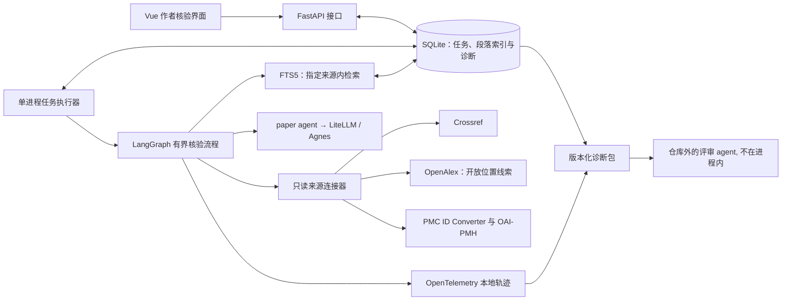
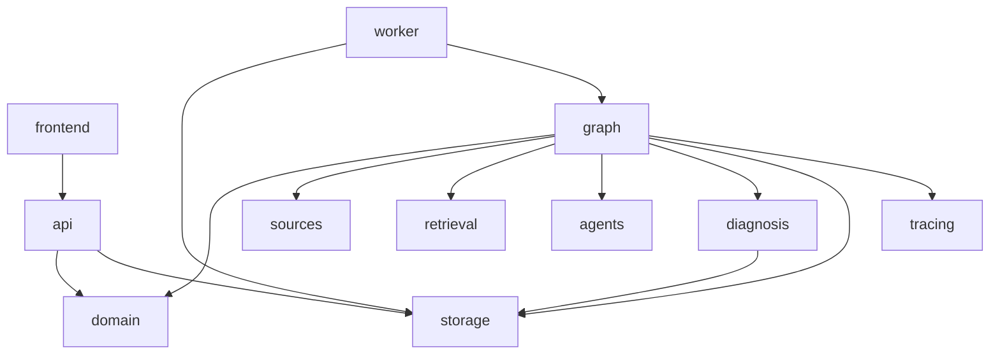
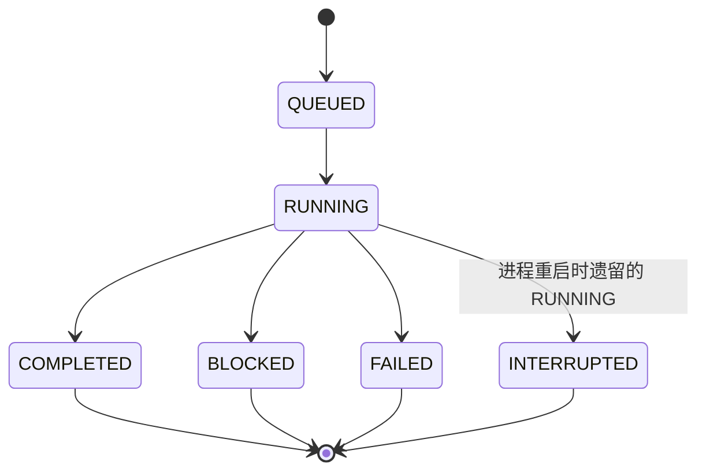
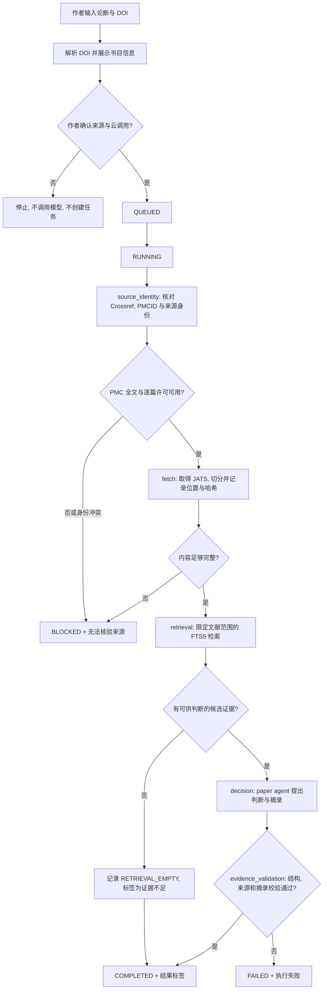

# 架构设计：论文引文证据核验 Agent

状态：设计稿  
版本：0.3  
日期：2026-09-27  
作者：Wynn  
读者：实现  
相关文档：[术语表](glossary.md)、[产品需求](prd.md)、[测试方案](test-plan.md)、[技术选型](tech-stack.md)

句子标记见 [术语表](glossary.md)。本文写组件、代码布局、状态迁移、接口和失败处理。结果标签、错误码和诊断包字段以术语表为准。参赛测试见 [测试方案](test-plan.md)。研究方案不在本文，也不进入运行时依赖。

## 1. 系统边界与组件

**规则**：首版在本机运行，一次处理一条论断和一篇被引文献。论断、任务记录和获准处理的段落留在本机。作者同意后，才把论断与候选开放片段发送给配置的模型，供 paper agent 使用。一次核验只调用一次模型。诊断包和轨迹交给仓库外的评审 agent；它们不在本进程内。文献连接器只读。模型不能指定任意网址、访问本地文件或修改来源记录。



前端与 API、执行器分开，是为了让外部请求和模型延迟不占用页面。任务写入 SQLite。执行器一次处理一个任务。paper agent 是唯一的模型调用。仓库外的评审 agent 不自由搜索，也不改任务目标。首版没有账户服务，也没有分布式队列。组件取舍见 [技术选型](tech-stack.md)。

## 代码布局

**规则**：实现时按下面的目录划分模块。不要把接口、图谱节点、来源连接器和测试放进同一个包。

- `frontend/`：作者界面。不保存密钥，不写判断规则。
- `backend/paper_evidence/domain/`：结果标签、任务状态、错误码、诊断包模型。无网络，无数据库。
- `backend/paper_evidence/storage/`：SQLite 与 FTS5。
- `backend/paper_evidence/sources/`：Crossref、PMC、OpenAlex。只读官方端点，不调用模型。
- `backend/paper_evidence/retrieval/`：当前文献的切分与检索。
- `backend/paper_evidence/agents/`：只放 paper agent 的提示词和输出结构校验。不能自己发 HTTP，也不能读本地文件。图谱不编排第二个 agent。
- `backend/paper_evidence/graph/`：LangGraph 节点。按下一节流程图编排，并且是唯一允许调用来源、检索和模型的地方。
- `backend/paper_evidence/diagnosis/`：从任务记录投影诊断包，并做脱敏。不自动改任务，也不充当路径二的测试产品。
- `backend/paper_evidence/tracing/`：本地 OpenTelemetry。
- `backend/paper_evidence/api/`：只入队和查询。
- `backend/paper_evidence/worker/`：一次运行一个任务。
- `tests/`：按 [测试方案](test-plan.md) 的维度分目录，包括 `functional/`、`tools/`、`retrieval/`、`session/`、`adversarial/`、`boundary/`、`performance/` 和 `e2e/`。
- `eval/`：若放置研究数据，只给研究评测使用。运行时包不得导入它。



**规则**：界面只调用 API。API 不进入图谱节点。图谱可以调用领域、来源、检索、Agent、诊断、存储和轨迹。Agent 与来源互不调用。诊断可以读存储以投影诊断包，但不能改任务状态。

流程图节点与包的对应：

- 输入、展示书目、确认、停止：`frontend/` 调用 `api/`。停止时不创建任务，不调用模型。
- `QUEUED`：`api/` 写入 `storage/`。
- `RUNNING`：`worker/` 从 `storage/` 领取任务并进入 `graph/`。
- `source_identity` 与许可判断：`graph/` 调用 `sources/`。错误码使用 `domain/`。
- 获取全文与完整性判断：`graph/` 调用 `sources/`，切分交给 `retrieval/`，哈希写入 `storage/`。
- 检索、有无候选：`graph/` 调用 `retrieval/` 和 `storage/` 的 FTS5。
- `RETRIEVAL_EMPTY`：`graph/` 把 `domain/` 中的「证据不足」写入 `storage/`，任务为 `COMPLETED`，不调用模型。
- 判断：`graph/` 调用 `agents/` 的 paper agent，只此一次。
- 证据校验：`agents/` 做结构校验。逐字摘录由 `graph/` 对照 `retrieval/` 保存的段落。失败码写入 `domain/`。
- `BLOCKED`、`FAILED`、`COMPLETED`：`graph/` 把 `domain/` 中的状态和标签写入 `storage/`。
- 诊断包：`diagnosis/` 从 `storage/` 投影。轨迹标识由 `graph/` 经 `tracing/` 写入。诊断包交给仓库外的评审 agent，不是执行流程里的状态转移。

## 2. 执行流程与状态

状态定义见 [任务状态](glossary.md#2-任务状态)。下图里的终态名称与该表一致。



**规则**：进程启动时，把遗留的 `RUNNING` 标为 `INTERRUPTED`，由作者明确重试。重试不沿上图把终态改回 `QUEUED`。它新建一条 `QUEUED` 任务，并保留原记录，避免静默重复外部调用。



`U` 使用 `SOURCE_MISMATCH`、`LICENSE_UNKNOWN` 或 `CONTENT_INCOMPLETE`。`X` 使用 `MODEL_INVALID_OUTPUT` 或 `QUOTE_MISMATCH`。外部请求超时或限流也进入 `X`，错误码为 `UPSTREAM_TIMEOUT`。这些码都不改写成学术标签。码与状态的对应见 [错误码](glossary.md#4-错误码)。

用户核验在 `U`、`X` 或 `M` 结束。诊断包对已创建的任务都可读取，由 `diagnosis/` 投影，交给 [测试方案](test-plan.md) 中的仓库外评审。外部评审的不同意见不改任务状态。

检索没有候选时，「证据不足」只表示这次检索尚未获得充分依据，不能推断全文必定没有证据。此时不调用模型。有候选时，模型只在已确认的来源片段上提出判断。完整正文不进入提示词。

**排除**：参赛实现不包含第二次内部模型调用。研究评测可以以后测量内部第二名评审是否有收益，那不是本流程的节点。

来源身份按这个顺序核对：DOI 标准化及 Crossref 元数据、作者确认题名、[PMC DOI/PMCID 转换](https://pmc.ncbi.nlm.nih.gov/tools/id-converter-api/)、PMC 记录中的 DOI 与版本一致性、逐篇许可。OpenAlex 提供开放位置和版本线索。它的“开放获取”字段单独使用时，不能当作复用许可。许可允许的自动处理范围见 [D9](tech-stack.md#d9-文献来源)。[OpenAlex 对许可字段的说明](https://help.openalex.org/data/works/open-access/)、[PMC 获取规则](https://pmc.ncbi.nlm.nih.gov/tools/oai/)

## 3. 接口

**规则**：下面的路径供本机客户端使用。诊断包的 JSON 形状只在 [术语表](glossary.md#6-诊断包) 给出一份。

任务不存在时返回 `404`，响应体为：

```json
{"error_code": null, "message": "<reason>"}
```

已有任务但请求不被允许时返回 `409`，并带上当前状态：

```json
{"error_code": null, "status": "<task-status>", "stage": "<stage-id>", "message": "<reason>"}
```

### `GET /api/sources/resolve`

| 项 | 内容 |
| --- | --- |
| 查询参数 | `doi` |
| `200` | `doi`（标准化）、`title`、`authors`、`year` |
| `400` | DOI 格式无效。不创建任务，不调用模型 |
| 约束 | 只读预览。`200` 不表示作者已确认来源 |

### `POST /api/checks`

| 项 | 内容 |
| --- | --- |
| 请求体 | `claim`、`doi`、`source_confirmed`、`cloud_consent` |
| `202` | `id`、`status`=`QUEUED`。入队后返回，不等待模型 |
| `400` | 两个确认字段不是同时为真，或 DOI、论断为空。不创建任务，不调用模型 |

### `GET /api/checks`

| 项 | 内容 |
| --- | --- |
| 查询参数 | 可选 `status`，取值见 [任务状态](glossary.md#2-任务状态) |
| `200` | 摘要数组。每项含 `id`、`doi`、`status`、`stage`、`label`。`label` 尚未产生时为 `null` |
| 约束 | 不返回缓存全文 |

### `GET /api/checks/{id}`

| 项 | 内容 |
| --- | --- |
| `200` | `id`、`status`、`stage`、`label`、`error_code`、`decision` |
| `decision` | `label`、`cited_paragraph_ids`、`quote`、`paragraph_id`、`validation` |
| 约束 | `label` 只使用结果标签的前五种。`FAILED` 时 `label` 为 `null`，界面根据状态显示「执行失败」。`BLOCKED` 时 `label` 为「无法核验来源」。paper agent 的标签不冒充真值。响应不含第二名 agent 的意见 |

### `GET /api/checks/{id}/diagnostic-packet`

| 项 | 内容 |
| --- | --- |
| `200` | [输入诊断包](glossary.md#6-诊断包) |
| 约束 | 默认 `input.privacy` 为 `redacted`，不返回论断原文、完整提示词或密钥。`consented` 包须作者另行授权后才可外传 |

### `POST /api/checks/{id}/feedback`

| 项 | 内容 |
| --- | --- |
| 请求体 | `comment` |
| `200` | `id`、`saved`=`true` |
| 约束 | 与 paper agent 的判断分开保存。不是完成任务的前置条件 |

### `POST /api/checks/{id}/retry`

| 项 | 内容 |
| --- | --- |
| `202` | `id`（新任务）、`status`=`QUEUED`、`previous_id` |
| `409` | 原任务不是终态 |
| 约束 | 保留原失败或原结果记录 |

### `DELETE /api/checks/{id}`

| 项 | 内容 |
| --- | --- |
| `200` | `id`、`deleted`=`true`、`message`（说明不能撤回云端数据） |
| `409` | 任务不是终态 |
| 约束 | 只删除本地任务及其关联记录。来源缓存仅在没有其他任务引用时清理 |

## 4. 本地记录与失败处理

**规则**：每条任务至少保存输入 DOI 与 Crossref 元数据、PMCID、所用全文版本与许可、来源 URL、获取时间、内容哈希、paper agent 的标签及限制说明、这一次模型调用的实际标识与提示词版本、轨迹 ID。证据项保存章节、JATS 段落标识、逐字摘录与段落哈希。JATS 没有稳定段落标识时，用版本哈希与段落顺序生成本地定位，并标明这种定位的局限。不另存一份内部评审记录。

诊断包是这些记录的版本化投影。默认外传包不包含完整提示词、论断原文和密钥。投影字段以术语表为准。

失败时的状态和标签按下表执行，定义见术语表，这里只保留处理动作。

| 条件 | 动作 |
| --- | --- |
| `SOURCE_MISMATCH` 或 `LICENSE_UNKNOWN` | 停止自动判断，不改用另一篇相似文献 |
| `CONTENT_INCOMPLETE` | 停止确定判断。paper agent 不凭缺失内容补结论 |
| `RETRIEVAL_EMPTY` | 标签记为「证据不足」，任务 `COMPLETED`，不调用模型 |
| `MODEL_INVALID_OUTPUT` | 受控重试一次。仍然无效则 `FAILED`，不展示确定判断 |
| `QUOTE_MISMATCH` | `FAILED`，不展示确定判断 |
| `UPSTREAM_TIMEOUT` | `FAILED`。超时和限流都走这条路径 |

**规则**：论文、网页和接口返回都是不可信数据，其中的指令不予执行。文献连接器只访问官方只读端点，并限制超时、重试次数和请求频率。

**规则**：SQLite 和获许可的缓存只放在本地，并排除出 Git。OpenTelemetry span 记录任务 ID、DOI 哈希或规范标识、来源版本哈希、候选段落 ID 与数量、阶段、工具名、耗时、错误码和 token 数。span 不记录论断原句、全文、完整提示词或密钥。完整语义诊断包只在本地生成。若交给仓库外的评审 agent，之前要预览字段、遵守来源许可，并取得作者对未发表论断的单独同意。用户核验本身不发起这次外传。实验用的输入和来源快照放在访问受控的本地数据集中，并另存版本标识。

轨迹说明哪一步观察到什么输入、输出或错误。它不能证明模型内部如何推理。受控故障的真因由隐藏的注入记录确定。自然样本中的争议需要独立标注，不能只凭 span 名称或 Agent 自述下结论。[OpenTelemetry 手动埋点](https://opentelemetry.io/docs/languages/python/instrumentation/)

## 5. 后续扩展接口

**排除**：整篇论文模式不是首版能力。以后若做，先抽取“引文句与参考文献”的候选对应，再请作者确认有歧义的映射，然后拆成现有的单条核验任务。PDF 解析的取舍见 [D10](tech-stack.md#d10-暂不采用)。
