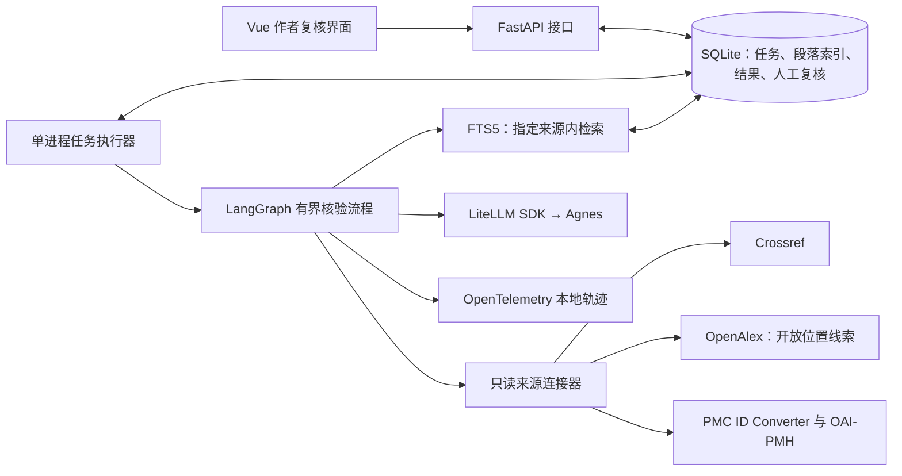
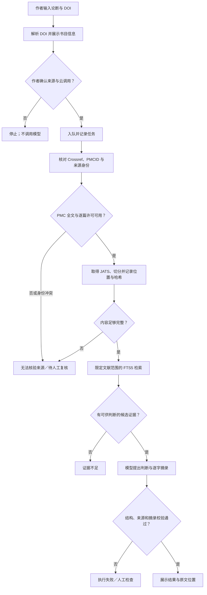

# 架构设计与研究评测：论文引文证据核验 Agent

> 状态：设计稿。接口、图示和实验协议均待实现与验证；本文不报告运行结果。

## 1. 系统边界与组件

首版是本地运行、面向单条论断和一篇被引文献的应用。用户的论断、任务记录和获准处理的段落保留在本机；只有作者同意后，才将论断与候选开放片段发送至配置的 Agnes 模型。文献连接器只读，模型不能指定任意网址、访问本地文件或修改来源记录。

前端与 API、执行器分开，是为了让外部请求和模型延迟不占用用户页面。任务持久化到 SQLite，执行器一次处理一个任务。首版不引入账户服务、分布式队列或多模型自治协商。[技术取舍](tech-stack.md)

## 2. 执行流程

外部请求超时、限流或模型格式无效走**执行失败**路径，不变成学术标签。FTS5 没找到候选时，“证据不足”仅表示这次检索未获得充分依据；不能推断全文必定无证据。模型只能在已确认的来源片段上提出判断。完整正文不作为提示词直接塞给模型。

来源身份按如下顺序核对：DOI 标准化及 Crossref 元数据 → 作者确认题名 → [PMC DOI/PMCID 转换](https://pmc.ncbi.nlm.nih.gov/tools/id-converter-api/) → PMC 记录中的 DOI 与版本一致性 → 逐篇许可。OpenAlex 提供开放位置和版本线索，但其“开放获取”字段不单独作为复用许可凭据。[OpenAlex 对许可字段的说明](https://help.openalex.org/data/works/open-access/)、[PMC 获取规则](https://pmc.ncbi.nlm.nih.gov/tools/oai/)

## 3. 接口与记录契约

| 接口 | 输入／输出 | 约束 |
| --- | --- | --- |
| `GET /api/sources/resolve?doi=...` | 返回标准化 DOI 与书目信息 | 只读预览；不调用模型，不把解析成功当成作者确认。 |
| `POST /api/checks` | 输入论断、DOI、`source_confirmed`、`cloud_consent`；返回任务 ID | 两项确认必须为真；任务入队后返回，不等待模型完成。 |
| `GET /api/checks` | 返回本地任务历史的摘要列表 | 不返回缓存全文；可按状态筛选。 |
| `GET /api/checks/{id}` | 返回状态、当前阶段、结果或错误类别 | 不把执行错误映射成“相矛盾”或“证据不足”。 |
| `POST /api/checks/{id}/reviews` | 输入人工标签与备注；返回独立复核记录 | 不修改原有机器判断。 |
| `POST /api/checks/{id}/retry` | 返回新的任务 ID，并关联原任务 | 仅对已终止任务可用；保留原始失败记录。 |
| `DELETE /api/checks/{id}` | 删除本地任务及其关联记录 | 只允许删除已终止任务；来源缓存仅在无其他任务引用时清理，且不能声称撤回云端数据。 |

任务状态为 `QUEUED`、`RUNNING`、`COMPLETED`、`NEEDS_REVIEW`、`FAILED`、`INTERRUPTED`。进程启动时将遗留的 `RUNNING` 标为 `INTERRUPTED`，由作者明确重试；重试生成新任务，避免静默重复外部调用。结果标签另存为“支持、部分支持、相矛盾、证据不足、无法核验来源”，与任务状态分离。

每条结果至少记录：输入 DOI 与 Crossref 元数据、PMCID、所用全文版本与许可、来源 URL、获取时间、内容哈希、判断标签和限制说明、模型及提示词版本、轨迹 ID。证据项保存章节、JATS 段落标识、逐字摘录与段落哈希；人工复核记录保存原任务 ID、人工标签、备注和时间。若 JATS 没有稳定段落标识，生成基于版本哈希与段落顺序的本地定位，并明确标注该定位的局限。

## 4. 可信边界与错误处理

- **身份与许可门槛**：DOI 指向不同论文、PMCID/DOI 不一致、许可未知或不是首版允许的 CC0/CC BY，均进入“无法核验来源”。不自动改用另一篇相似文献。
- **内容完整性门槛**：JATS 缺失、解析失败，或结论依赖未能可靠读取的表格、图像时进入人工复核。摘要与参考文献列表不能代替目标全文。
- **输出校验门槛**：Pydantic 检查标签、必需字段和证据引用；逐字摘录必须存在于同版本的原文段落。模型格式无效只受控重试一次；仍无效、出现错误来源或摘录不匹配时记录 `MODEL_INVALID_OUTPUT` 或 `QUOTE_MISMATCH`，不展示确定判断。
- **输入与工具边界**：论文、网页与接口返回都是不可信数据，不执行其中的指令。文献连接器限制为官方只读端点并限制网络超时、重试次数与请求频率；错误类型保留 `SOURCE_MISMATCH`、`LICENSE_UNKNOWN`、`CONTENT_INCOMPLETE`、`RETRIEVAL_EMPTY`、`UPSTREAM_TIMEOUT` 等可区分原因。
- **隐私与复现**：SQLite 和获许可的缓存仅放本地、排除出 Git；云调用前取得同意。OpenTelemetry span 记录任务 ID、DOI 哈希或规范标识、来源版本哈希、候选段落 ID 与数量、阶段、工具名、耗时、错误码和 token 数，不记录论断原句、全文、完整提示词或密钥。实验所需输入和来源快照放在访问受控的本地数据集中，另存其版本标识。

轨迹能说明“哪一步观察到什么输入输出或错误”，不能证明模型内部如何推理。研究中的错误归因须由标注标准和人工复核确认，不能仅凭 span 名称自动下结论。[OpenTelemetry 手动埋点文档](https://opentelemetry.io/docs/languages/python/instrumentation/)

## 5. 后续扩展接口

整篇论文模式将先抽取“引文句—参考文献”候选对应关系，再要求作者确认有歧义的映射，最后拆成现有的单条核验任务。可评估 [GROBID 的全文与引文解析](https://grobid.readthedocs.io/en/latest/Grobid-service/)，但其解析准确率和页码定位须单独评测。首版不以这项扩展作为已具备能力。

## 6. 研究评测设计

研究问题分开检验：**证据门槛是否减少错误的确定判断？** **轨迹是否帮助人更准确、更快定位缺陷？** 现阶段只有实验方案，没有实验结果或可投稿性的保证。

1. **数据**：[SciFact](https://github.com/allenai/scifact/blob/master/doc/data.md) 的标签与证据来自摘要，适合摘要级流水线自检，不能当作 PMC 全文评测结果。另从引文所在论文和被引文献均逐篇核实许可的 PMC 全文中收集“论断—被引文献”配对；先导集用于改进标注指南，不并入冻结的正式测试集。正式集目标不少于 120 对，双人独立标注来源身份、判断标签与原文位置，分歧仲裁并报告一致性。按论文分组切分，避免同一论文同时进入调试集和测试集；人工构造的故障样本单列，不改变自然样本的类别比例。
2. **对照**：在同一 PMC 测试集上比较“只给被引文献摘要的直接判定”“使用相同候选全文片段但取消证据门槛”“完整系统”；SciFact 结果另报，不与全文实验混算。主要对照固定同一模型和样本；DeepSeek 等模型作为另行报告的跨模型实验，不以自动回退混入结果。记录模型响应标识、参数、提示词版本、数据集与来源快照哈希。
3. **质量指标**：分别报告可判定覆盖率、应拒判样本上的错误确定判断率、来源匹配准确率、证据 Recall@k 与摘录定位有效率；仅在人工判为可判定的样本上计算判断 macro-F1。报告实际样本数、类别分布和不确定区间，不把覆盖率低的系统用条件准确率包装成整体更优。
4. **故障归因实验**：单独注入身份错配、许可缺失、检索遗漏、上游超时和摘录错配等故障。请未参与开发的复核者在“只看最终输出”和“可看输出及轨迹”之间做平衡顺序的对照，测量缺陷定位准确率与用时；错误真因以注入记录和人工核对为准。

若正式集、独立复核或对照实验未完成，研究结论只能停留在先导实验层级。任何将来报告的数字都须指向数据版本、运行配置与原始记录。
