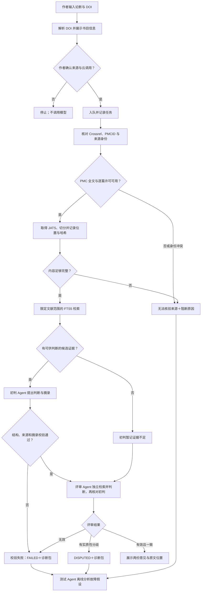

# 架构设计与研究评测：论文引文证据核验 Agent

> 状态：设计稿。接口、图示和实验协议均待实现与验证；本文不报告运行结果。

## 1. 系统边界与组件

首版是本地运行、面向单条论断和一篇被引文献的应用。用户的论断、任务记录和获准处理的段落保留在本机；只有作者同意后，才将论断与候选开放片段发送至配置的 Agnes 模型，分别供初判与独立评审使用。测试 Agent 读取脱敏诊断包或经用户授权的完整包；文献连接器只读，模型不能指定任意网址、访问本地文件或修改来源记录。


前端与 API、执行器分开，是为了让外部请求和模型延迟不占用用户页面。任务持久化到 SQLite，执行器一次处理一个任务。评审 Agent 是固定的第二道核验步骤，测试 Agent 属于离线评测与缺陷分析流程；两者都不以自由搜索或自主修改任务为目标。首版不引入账户服务或分布式队列。[技术取舍](tech-stack.md)

## 2. 执行流程



外部请求超时、限流或模型格式无效走**执行失败**路径，不变成学术标签。FTS5 没找到候选时，“证据不足”仅表示这次检索未获得充分依据；不能推断全文必定无证据。评审 Agent 可对同一指定文献重新检索，避免只复述初判候选；它先在不看初判标签的上下文中形成意见，再对照初判摘录。模型只能在已确认的来源片段上提出判断，完整正文不作为提示词直接塞给模型。两次独立调用增加成本和延迟，需在实验中测量收益。

来源身份按如下顺序核对：DOI 标准化及 Crossref 元数据 → 作者确认题名 → [PMC DOI/PMCID 转换](https://pmc.ncbi.nlm.nih.gov/tools/id-converter-api/) → PMC 记录中的 DOI 与版本一致性 → 逐篇许可。OpenAlex 提供开放位置和版本线索，但其“开放获取”字段不单独作为复用许可凭据。[OpenAlex 对许可字段的说明](https://help.openalex.org/data/works/open-access/)、[PMC 获取规则](https://pmc.ncbi.nlm.nih.gov/tools/oai/)

## 3. 接口与记录契约

| 接口 | 输入／输出 | 约束 |
| --- | --- | --- |
| `GET /api/sources/resolve?doi=...` | 返回标准化 DOI 与书目信息 | 只读预览；不调用模型，不把解析成功当成作者确认。 |
| `POST /api/checks` | 输入论断、DOI、`source_confirmed`、`cloud_consent`；返回任务 ID | 两项确认必须为真；任务入队后返回，不等待模型完成。 |
| `GET /api/checks` | 返回本地任务历史的摘要列表 | 不返回缓存全文；可按状态筛选。 |
| `GET /api/checks/{id}` | 返回状态、阶段、初判与评审意见、分歧或错误类别 | 不把执行错误映射成“相矛盾”或“证据不足”；不以一致意见冒充真值。 |
| `GET /api/checks/{id}/diagnostic-packet` | 返回供测试 Agent 使用的版本化 JSON 包 | 默认遮盖论断原文、提示词与密钥；完整语义包须作者另行授权外传。 |
| `POST /api/checks/{id}/feedback` | 保存作者自愿提供的意见 | 与两名 Agent 的判断分开保存；不是完成任务的前置条件。 |
| `POST /api/checks/{id}/retry` | 返回新的任务 ID，并关联原任务 | 仅对已终止任务可用；保留原始失败记录。 |
| `DELETE /api/checks/{id}` | 删除本地任务及其关联记录 | 只允许删除已终止任务；来源缓存仅在无其他任务引用时清理，且不能声称撤回云端数据。 |

任务状态为 `QUEUED`、`RUNNING`、`COMPLETED`、`DISPUTED`、`BLOCKED`、`FAILED`、`INTERRUPTED`。`DISPUTED` 表示两名 Agent 意见存在实质性分歧，`BLOCKED` 表示来源、许可、完整性或证据门槛未通过，`FAILED` 表示执行错误；这三者不混为同一学术标签。进程启动时将遗留的 `RUNNING` 标为 `INTERRUPTED`，由作者明确重试；重试生成新任务，避免静默重复外部调用。结果标签另存为“支持、部分支持、相矛盾、证据不足、无法核验来源”，与任务状态分离。

每条结果至少记录：输入 DOI 与 Crossref 元数据、PMCID、所用全文版本与许可、来源 URL、获取时间、内容哈希、初判与评审标签及限制说明、两次模型调用的实际标识与提示词版本、轨迹 ID。证据项保存章节、JATS 段落标识、逐字摘录与段落哈希；评审记录单独保存其检索候选、证据引用、对初判的异议及结构校验结果，不覆盖初判。若 JATS 没有稳定段落标识，生成基于版本哈希与段落顺序的本地定位，并明确标注该定位的局限。

### 供测试 Agent 使用的诊断包

诊断包采用稳定的 `schema_version` 和 JSON 字段，供 Codex 等测试 Agent 在本地读取或经授权后接收。最小字段如下；字段指向本地冻结的任务与来源快照，不能只给一段自然语言总结。

| 字段 | 内容与用途 |
| --- | --- |
| `case_id`、`run_id`、`trace_id`、`schema_version` | 关联一次任务、一次运行和轨迹；可复现和比较回归。 |
| `input` | 标准化 DOI、论断范围及隐私级别；默认外传包遮盖未发表论断，语义核验需要作者授权的原句。 |
| `source` | 题名、DOI/PMCID、许可、版本、获取入口、时间和内容哈希；便于排查错源、错版和许可门槛。 |
| `evidence_candidates` | 初判与评审各自检索到的段落 ID、章节、排名、摘录、段落哈希及原文链接；标注段落是否实际进入模型上下文。 |
| `decisions` | 两名 Agent 各自的标签、理由所引用的段落 ID、结构校验结果、分歧点及拒判原因。 |
| `execution` | 按阶段排序的调用名、已脱敏参数摘要、耗时、状态、错误码、提示词/模型版本和重试次数；连接对应 span ID。 |
| `diagnosis` | 由测试 Agent 另行写入的故障假设、关联证据、置信度或不确定性、建议复现步骤与回归检查；不覆盖原始记录。 |

诊断包不向测试 Agent 泄露故障注入的真因或正式评测标签；这些仅由评测器保存。测试 Agent 对每个结论必须引用包内字段或只读原文位置，将“已观察到的异常”“可能根因”“需额外复现”分开写。结构化包有利于比较机器排障，但不能证明某个模型能正确找到根因。

下面是字段形状示意，所有值均为占位符而非运行记录。`diagnosis` 由测试 Agent 另写，评测器不得把隐藏的故障标签放入输入包。

```json
{
  "schema_version": "1.0",
  "case_id": "<case-id>",
  "run_id": "<run-id>",
  "trace_id": "<trace-id>",
  "input": {"doi": "<normalized-doi>", "claim": "<redacted-or-consented-text>", "privacy": "redacted"},
  "source": {"pmcid": "<pmcid>", "license": "<verified-license>", "version_hash": "<hash>"},
  "evidence_candidates": [{"agent": "initial", "paragraph_id": "<id>", "rank": 1, "entered_context": true, "quote": "<licensed-excerpt>"}],
  "decisions": [{"agent": "initial", "label": "<label>", "cited_paragraph_ids": ["<id>"], "validation": "<status>"}],
  "execution": [{"stage": "retrieval", "span_id": "<span-id>", "tool": "fts5", "status": "<status>", "error_code": null, "duration_ms": 0}]
}
```

默认脱敏包可用于检查来源、工具与执行故障；没有原句时，测试 Agent 不得声称核实了语义标签。完成语义复核必须在用户授权范围内提供论断原句和可复查的获许可片段，并明确接收方。

测试 Agent 的返回值也采用固定结构：`outcome` 取 `confirmed`、`suspected` 或 `insufficient_evidence`；每条 `finding` 含错误阶段与类别、观察到的异常、引用的 `span_id`／段落 ID／诊断包字段路径、根因假设、只读复现步骤、回归断言和不确定性说明。只有复现步骤或确定性校验支持时才可写 `confirmed`；仅靠模型解释须写 `suspected`。评测程序按这些字段核对隐藏的注入真因和引用有效性，不使用一段自由文本的“看起来合理”作为通过标准。默认诊断只读，不让测试 Agent 自动修改论文、仓库或来源缓存。

## 4. 可信边界与错误处理

- **身份与许可门槛**：DOI 指向不同论文、PMCID/DOI 不一致、许可未知或不是首版允许的 CC0/CC BY，均进入“无法核验来源”。不自动改用另一篇相似文献。
- **内容完整性门槛**：JATS 缺失、解析失败，或结论依赖未能可靠读取的表格、图像时返回 `CONTENT_INCOMPLETE` 并停止确定判断。评审 Agent 也不能凭缺失内容补出结论；摘要与参考文献列表不能代替目标全文。
- **输出校验门槛**：Pydantic 检查标签、必需字段和证据引用；逐字摘录必须存在于同版本的原文段落。模型格式无效只受控重试一次；仍无效、出现错误来源或摘录不匹配时记录 `MODEL_INVALID_OUTPUT` 或 `QUOTE_MISMATCH`，不展示确定判断。
- **输入与工具边界**：论文、网页与接口返回都是不可信数据，不执行其中的指令。文献连接器限制为官方只读端点并限制网络超时、重试次数与请求频率；错误类型保留 `SOURCE_MISMATCH`、`LICENSE_UNKNOWN`、`CONTENT_INCOMPLETE`、`RETRIEVAL_EMPTY`、`UPSTREAM_TIMEOUT` 等可区分原因。
- **隐私与复现**：SQLite 和获许可的缓存仅放本地、排除出 Git；初判与评审的云调用前取得同意。OpenTelemetry span 记录任务 ID、DOI 哈希或规范标识、来源版本哈希、候选段落 ID 与数量、阶段、工具名、耗时、错误码和 token 数，不记录论断原句、全文、完整提示词或密钥。完整语义诊断包只在本地生成；交给外部测试 Agent 前预览字段、遵守来源许可并取得作者对未发表论断的单独同意。实验所需输入和来源快照放在访问受控的本地数据集中，另存其版本标识。

轨迹能说明“哪一步观察到什么输入输出或错误”，不能证明模型内部如何推理。测试 Agent 可据此提出可检查的根因假设；受控故障的真因由隐藏的注入记录确定，自然样本中的争议则需独立标注证据，不能仅凭 span 名称或 Agent 自述下结论。[OpenTelemetry 手动埋点文档](https://opentelemetry.io/docs/languages/python/instrumentation/)

## 5. 后续扩展接口

整篇论文模式将先抽取“引文句—参考文献”候选对应关系，再要求作者确认有歧义的映射，最后拆成现有的单条核验任务。可评估 [GROBID 的全文与引文解析](https://grobid.readthedocs.io/en/latest/Grobid-service/)，但其解析准确率和页码定位须单独评测。首版不以这项扩展作为已具备能力。

## 6. 研究评测设计

研究问题分开检验：**证据门槛与独立评审是否减少错误的确定判断？** **结构化诊断包及轨迹是否帮助测试 Agent 更准确、更快定位缺陷？** 现阶段只有实验方案，没有实验结果或可投稿性的保证。

1. **数据**：[SciFact](https://github.com/allenai/scifact/blob/master/doc/data.md) 的标签与证据来自摘要，适合摘要级流水线自检，不能当作 PMC 全文评测结果。另从引文所在论文和被引文献均逐篇核实许可的 PMC 全文中收集“论断—被引文献”配对；先导集用于改进标注指南，不并入冻结的正式测试集。正式集目标不少于 120 对，可用 Agent 预标注以节省整理工作，但用于报告准确率的真值须由两名独立人员核对来源身份、判断标签与原文位置，分歧仲裁并报告一致性。这是研究测量的基准制作，不是产品逐条运行时的人工核验。按论文分组切分，避免同一论文同时进入调试集和测试集；受控故障样本单列，不改变自然样本的类别比例。
2. **核验对照**：在同一 PMC 测试集上比较“只给被引文献摘要的直接判定”“使用相同候选全文片段但取消证据门槛”“有证据门槛的单 Agent”“加入独立评审 Agent 的完整系统”，检验第二次调用是否有净收益。SciFact 结果另报，不与全文实验混算。主要对照固定模型、样本与检索预算；DeepSeek 等模型作为另行报告的跨模型实验，不以自动回退混入结果。记录每次模型响应标识、参数、提示词版本、数据集与来源快照哈希及 token/延迟成本。
3. **质量指标**：分别报告可判定覆盖率、应拒判样本上的错误确定判断率、来源匹配准确率、证据 Recall@k 与摘录定位有效率；仅在独立基准标为可判定的样本上计算判断 macro-F1。报告实际样本数、类别分布和不确定区间，不把覆盖率低的系统用条件准确率包装成整体更优。
4. **Agent 故障归因实验**：单独注入身份错配、许可缺失、检索遗漏、上游超时和摘录错配等故障；注入清单只供评测器使用。让固定配置的测试 Agent 比较“只看最终输出”“看结构化诊断包但无轨迹”“看诊断包及轨迹”，按样本平衡顺序，测量根因分类准确率、证据引用正确率、错误修复建议可复现率、耗时与 token 成本。真因由注入记录及确定性断言给出，不要求人员逐例排障；无法由轨迹判定的根因应允许 Agent 回答不确定。自然论文样本的语义误判不能直接以注入标签代替真值。

若正式集、独立基准标注或对照实验未完成，研究结论只能停留在先导实验层级。任何将来报告的数字都须指向数据版本、运行配置与原始记录。
